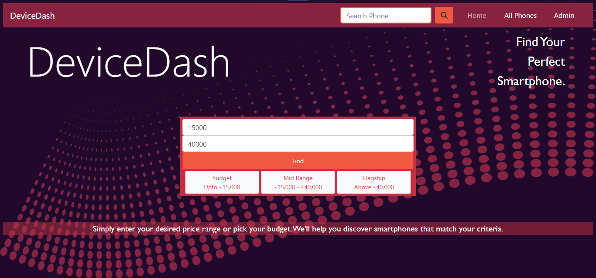

# DeviceDash

 _A Smartphone Recommendation Website using Django._

In a world brimming with a multitude of smartphone options, making the right choice can often feel like navigating a labyrinth. That's where **DeviceDash** comes in.
Finding a smartphone that seamlessly integrates into your lifestyle, meets your requirements, and fits your budget is of great importance. DeviceDash simplify the steps one needs to take by recommending the most suitable smartphone within a few seconds. This user-friendly, responsive website lets the user choose a price range, with just a few clicks, and returns the top 10 most apt smartphones in that range. The simplicity and efficiency of this project empowers people overwhelmed by the myriad options available, offering a straightforward solution to finding their perfect match.

## Distinctiveness and Complexity

DeviceDash is a web application which provides smartphone recommendation based on the price range entered by the user. The website is made using various skills and knowledge obtained during this course, combining them together to develop a practical and handy application. The website starts with a form that recieves a price range from the user. The form entries are validated using JavaScript. After recieving the price input, the user is taken to a page which displays the recommended phones based on user input. A large amount of data regarding smartphones is required to provide this. The data was obtained using *Web Scraping* in python. The website _gsmarena_ was scraped using **BeautifulSoup** module in python, to obtain data regarding all smartphones in the market. The scraping process required months of effort and was obeying all website guidelines, and following the *robots.txt* file of the site. The data was fetched from the website and stored to the Django Database as several models. The cards are displayed in a user-friendly and attractive design using CSS styles.

The application provides an "All Phones" button in the navigation bar, which lets users see a list of all phones available in the database. The search bar lets users search for a phone by the name or brand, and displays the result by querying the database using **Q**. There is also a facility for admin login, which lets the administrator add new phones to the database through a form. Admin can also logout from their account through a link in the navbar. The navigation bar is dynamically modified based on the current state of the website. The entire website is stylishly designed to attract users.

Buttons are included in the home page to quickly select a price range rather than entering the starting and ending prices, which categorizes the price range into Budget, Mid Range and Flagship phones. The data scraped to be used has undergone various cleanups before they were of suitable format. The project is sufficiently distinct from an e-commerce website or a social media website and uses almost all of the skills covered in the course. It uses Django on the backend, with multiple models and JavaScript on the front end, including stylish designing using CSS. 
 
 ## Design

   * Create Models - Done
   * Fetching - Done
   * Storing Brands - Done
   * Storing Phones - Done
   * Storing Specs - Done
   * Fetching Database === Fail
      New Table to create
   * Create "Devices" - Done

      |column|datatype|
      |------|--------|
      |brand|f-key|
      |device|f-key|
      |price|int|
      |popularity|float|
   * Storing in Devices - Done (currency conversion)
   * Find Phone - Done
   * View Phone - Done
   * Home - Done 
   * Login - Done
   * Logout - Done
   * Add Phone - Done
   * All Phones - Done (Pagination)
   * Search - Done
   * Design - Done

   
 3. Display phones according to user input

 ## Implementation

### scrape.py
* getDataFromUrl(url) - returns the source of a page
* getBrands() - returns a list of all brands
* getBrand(brand_id) - returns a list of all phones of a particular brand
* getNextPage(beautifulsoup_object) - returns the next page, if there is one
* getDevice(device_id) - returns all details regarding a device

* getDevices(soup, devices_list) - returns a refined list of devices, to use in the website